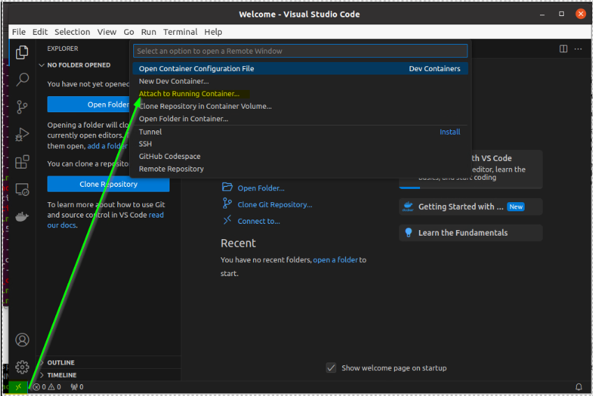

# Guide d'Installation de l'Environnement Tiago CESI

Ce guide détaille la mise en place de l'environnement de développement pour le robot TIAGO au CESI. Il est conçu pour un environnement Ubuntu 20.04 et suppose une familiarité avec Linux.

## Prérequis

- Ubuntu 20.04
- Docker installé et configuré
- Image Docker fournie par CESI (`docker_tiagocesi_container_full.tar.gz`) (demandé au pilote de l'option)

## 1. Configuration de l'Environnement Docker

### 1.1 Import de l'Image Tiago

Importez l'image fournie par le CESI :

```bash
docker import docker_tiagocesi_container_full.tar.gz docker_tiagocesi_image_full

# Vérification de l'import
docker image list
```

### 1.2 Création du Conteneur de Simulation

Lancez le conteneur avec la configuration appropriée :

```bash
docker run \
  -it \
  -d \
  -u user \
  -e DISPLAY=$DISPLAY \
  -p 80:80 \
  -p 8000:8000 \
  -p 443:443 \
  -p 9090:9090 \
  --privileged \
  -v /tmp/.X11-unix/:/tmp/.X11-unix/ \
  --name="tiago" \
  docker_tiagocesi_image_full \
  bash
```

> **Note pour macOS**: Sur macOS, installez XQuartz et remplacez `-e DISPLAY=$DISPLAY` par `-e DISPLAY=host.docker.internal:0`

### 1.3 Configuration de l'Environnement de Développement pour la Simulation

1. Accédez au conteneur :
```bash
docker exec -it tiago bash
```

2. Configurez le fichier `.bashrc` avec les lignes suivantes à la fin du fichier :
```bash
source /usr/share/cesi-conda/miniconda3cesi/bin/activate
source /opt/pal/gallium/setup.bash
source /usr/share/cesi-tiago-package/behaviour_tree/ws_behaviotree/devel/setup.bash
```

3. Intégration avec VSCode (recommandé) :
   - Lancez VSCode depuis le terminal
   
   - Connectez-vous au conteneur Docker via l'extension Remote Containers
  

## 2. Simulation de Base

Exécutez les commandes suivantes dans l'ordre :

```bash
# Démarrage des services
sudo service apache2 start
sudo cesi_gazebo_very_high_speed

# Lancement de la simulation
roslaunch tiago_dual_187_gazebo tiago_dual_navigation.launch webgui:=true
```

Accédez à l'interface de contrôle : http://localhost/
- Identifiant : `pal`
- Mot de passe : `pal`

## 3. Connexion au Robot TIAGO Physique

### 3.1 Préparation de l'Environnement

1. Activez l'accès X11 sur la machine hôte :
```bash
xhost +local:
```

2. Créez un nouveau conteneur pour la connexion physique :
```bash
docker run \
  -it \
  -d \
  -u user \
  -e DISPLAY=$DISPLAY \
  --network host \
  --privileged \
  -v /tmp/.X11-unix/:/tmp/.X11-unix/ \
  --name="tiago-real" \
  docker_tiagocesi_image_full \
  bash
```

### 3.2 Configuration du Conteneur pour le Robot Réel

1. Configuration des hôtes (en tant que root) :
```bash
docker exec -it -u root tiago-real bash
nano /etc/hosts

# Ajoutez
10.68.0.1   tiago-202c  # Ajustez selon votre robot
```

2. Configurez le fichier `.bashrc` avec les lignes suivantes à la fin du fichier :

```bash
docker exec -it tiago-real bash
```

```bash
source /usr/share/cesi-conda/miniconda3cesi/bin/activate
source /opt/pal/gallium/setup.bash
source /usr/share/cesi-tiago-package/behaviour_tree/ws_behaviotree/devel/setup.bash
export ROS_MASTER_URI=http://tiago-202c:11311    # Le nom du robot est à ajuster selon le vôtre
export ROS_IP=10.68.0.XX                        # À ajuster selon votre adresse IP dans le conteneur
```

## Notes Importantes

- Pour les machines virtuelles, configurez deux cartes réseau :
  1. NAT pour l'accès Internet
  2. Accès par pont pour la connexion au robot
- Le numéro de série du robot se trouve sur une étiquette à l'arrière
- Vérifiez toujours la compatibilité des adresses IP entre votre conteneur et le robot
