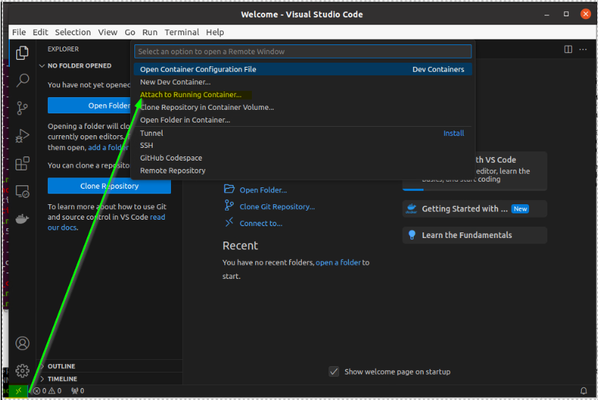
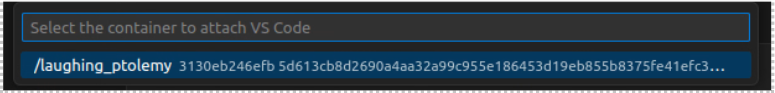

# Documentation Tiago CESI

Cette documentation considère que vous êtes familié avec les environnements Linux. Toutes les commandes décrites ci-après, ont été testées dans un environnement Ubuntu 20.04.

## Prérequis

Disposer d'une machine Ubuntu 20.04 avec Docker installé. Se référer à [PRERIQUISITES.md](PREREQUISITES.md)

## Installation des outils

Pour pouvoir utiliser l'environnement de développement mis à disposition par CESI pour utiliser le robot TIAGO suivez les étapes qui seront décrites.
Dans un premier temps, il convient d'avoir télécharger l'image Docker fournie par le CESI. Dans cette documentation, l'image se nomme `docker_tiagocesi_container_full.tar.gz`

### Charger l'image de Tiago

Nous allons importer l'image fournie par le CESI dans docker et la renomée `docker_tiagocesi_image_full`.

```bash
docker import docker_tiagocesi_container_full.tar.gz docker_tiagocesi_image_full
```

Vérifiez que cette dernière a bien été importée.
```bash
docker image list
```

### Démarrer un conteneur

Pour démarrer le conteneur contenant les paquets ROS de Tiago utilisez la commande suivante:
```bash
docker run \
  -it \
  -d \
  -u user \
  -e DISPLAY=$DISPLAY \
  -p 80:80 \
  -p 8000:8000 \
  -p 443:443 \
  -p 9090:9090 \
  --privileged \
  -v /tmp/.X11-unix/:/tmp/.X11-unix/ \
  --name="tiago" \
  docker_tiagocesi_image_full \
  bash
```

> NB: Sur MAC qui est un environnement UNIX il est nécéssaire d'installer XQuartz pour pouvoir utiliser les GUI des outils au sein du Docker. Il faudra alors remplacer `-e DISPLAY=$DISPLAY` par `-e DISPLAY=host.docker.internal:0`.

Vous pouvez ensuite accéder au docker en utilisant :

```bash
docker exec -it tiago bash
```

Pour plus d'aisance il est recommandé de passer par un environnement VSCode pouvant accéder au conteneur Docker.
Dans un terminal saisir:  


Cela lance une fenetre VSCode. Connectez vous au conteneur Docker de tiago.



## Lancer une simulation de base

> Les commandes qui suivent sont citées dans la documentation fournie par le CESI. Si l'image à été mise à jour, il se peut que ces commandes ne soient plus fonctionnelles ou que les chemins des fichiers soient erronés.

```bash
sudo service apache2 start
sudo cesi_gazebo_very_high_speed
source /opt/pal/gallium/setup.bash
source /usr/share/cesi-tiago-package/behaviour_tree/ws_behaviotree/devel/setup.bash
roslaunch tiago_dual_187_gazebo tiago_dual_navigation.launch webgui:=true
```

Gazebo et RViz devrait se lancer. Vous pouvez accéder à l'interface de controle de Tiago en utilisant: [localhost](http://localhost/). Les identifiants sont `pal` et `pal`.